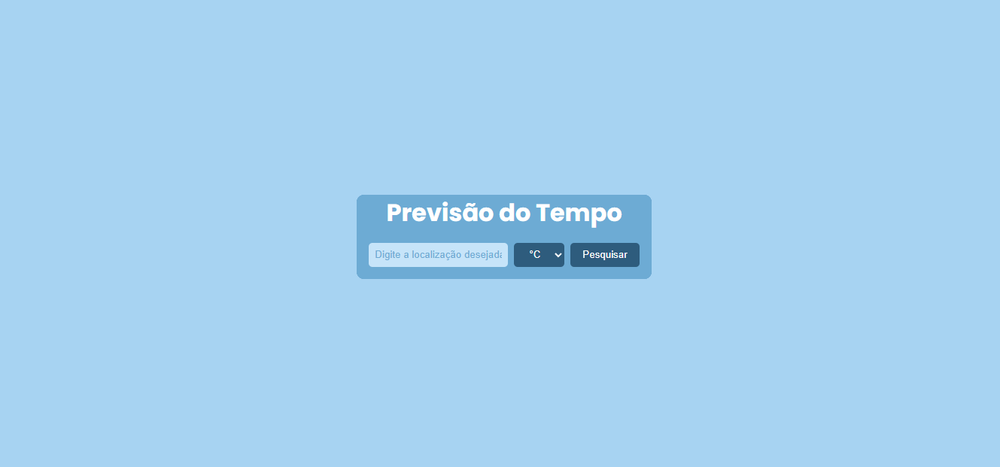

# 🌤️ Previsão do Clima

Implementação simples para visualizar a previsão do clima de uma região e sua temperatura atual, com opção de escolha da escala (Celsius, Fahrenheit ou Kelvin), usando a API [OpenWeather](https://openweathermap.org/).

## 🖼️ Exemplo da Interface

É necessário o NPM, NODE e uma Chave de API do openweather para rodar o código
